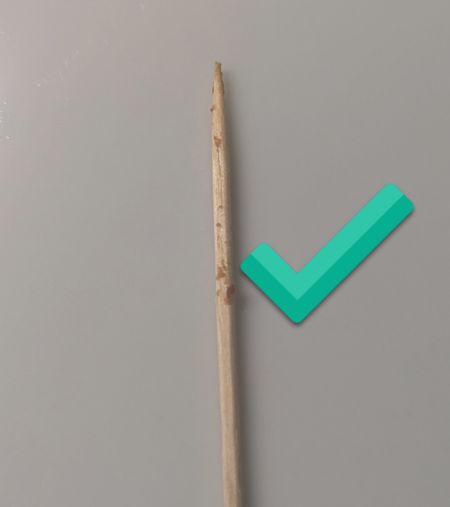
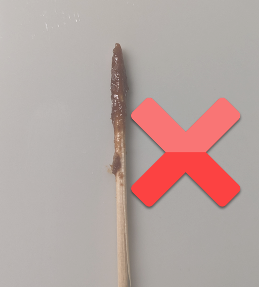

# Einfache Brownies

| Menge  | Zutat                                                                                              |
|--------|----------------------------------------------------------------------------------------------------|
| 3      | Eier                                                                                               |
| 1/2 Pk | Vanillezucker                                                                                      |
| 175 g  | Zucker                                                                                             |
|        | Schaumig schlagen                                                                                  |
| 125 g  | Dunkle Schokolade                                                                                  |
| 125 g  | Butter                                                                                             |
|        | Schmelzen und mit einer prise Salz unter die Eier-Zucker-Masse heben. Schaumig und Luftig schlagen |
| 75 g   | Mehl                                                                                               |
|        | Vorsichtig mit Schwingbesen darunter heben                                                         |

20 - 28 Min (abhängig von der Dicke) bei 180°C mit Oben- und Unterhitze backen.

Nach belieben mit dem Mehl Nüsse (ca. 50g), gehackte Schokolade oder Kokossplitter dazugeben.

Mit Puderzucker dekorieren

## Tipps
### Backblech
Das Ganze gibt eine Masse von ca. 650g. Für eine ideale Dicke der Brownies, verwende ich ein rundes Backblech mit ca. 25-28cm Innendurchmesser, oder ein quadratisches mit innerer Seitenlänge von ca. 23cm.

### Ankleben an Blech
Damit die Brownies nicht am Backblech ankleben, kann das Blech mit Butter eingeschmiert und mit Mehl bestäubt werden.

### Zahnstocherkontrolle
Mit dem Zahnstocher kann nach ca. 20 Minuten in die Mitte gestochen und kontrolliert werden ob noch etwas kleben bleibt. Falls viel flüssige Schokoladenmasse dran ist, dann sollte der Backofen sofort geschlossen und nach wenigen Minuten erneut kontrolliert werden. Wenn ein wenig, eher trockene Masse daran klebt, sind die Brownies gut. Bei zu langem Warten werden die Brownies sehr trocken, daher sollte möglichst früh die Kontrolle durchgeführt werden.

*Zahnstocherkontrolle Gut*

*Zahnstocherkontrolle Schlecht*

## Bilder

*Einfache Brownies*

*Einfache Brownies*

*Einfache Brownies mit Nüssen*

*Einfache Brownies mit Nüssen*
