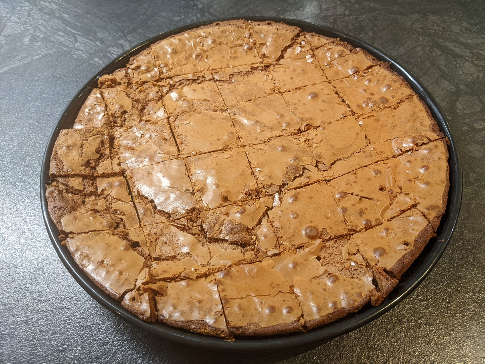
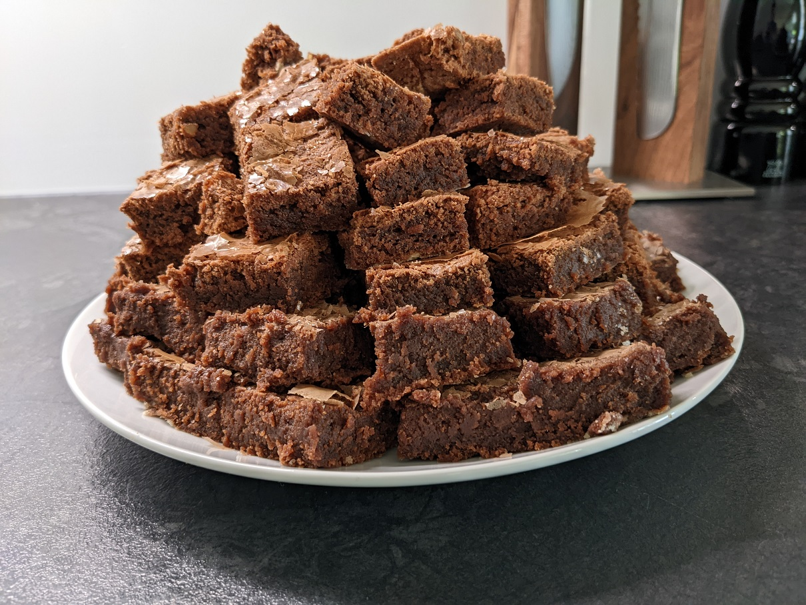
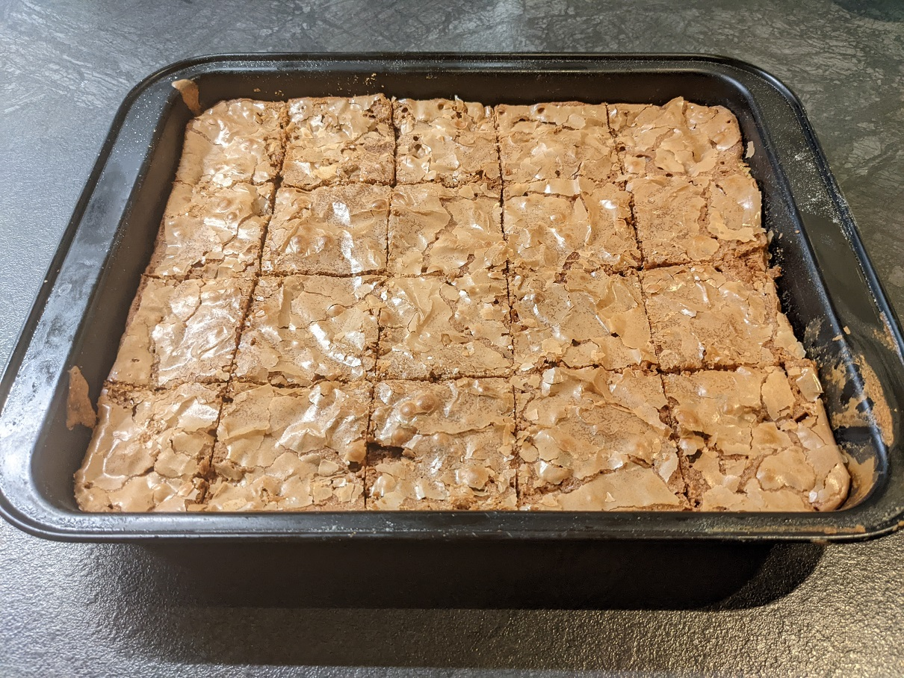
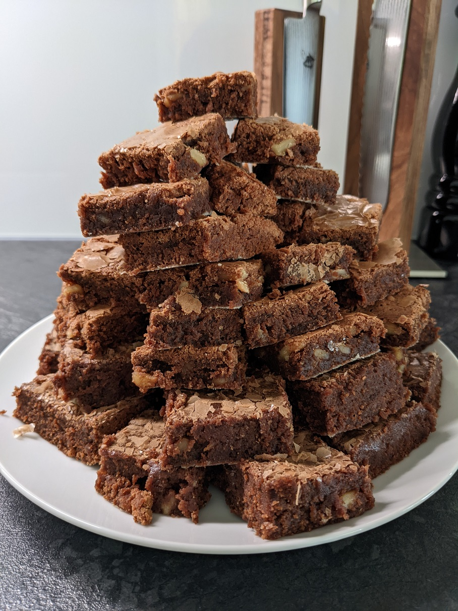

# Einfache Brownies

| Menge  | Zutat                                                                                              |
|--------|----------------------------------------------------------------------------------------------------|
| 3      | Eier                                                                                               |
| 1/2 Pk | Vanillezucker                                                                                      |
| 175 g  | Zucker                                                                                             |
|        | Schaumig schlagen                                                                                  |
| 125 g  | Dunkle Schokolade                                                                                  |
| 125 g  | Butter                                                                                             |
|        | Schmelzen und mit einer prise Salz unter die Eier-Zucker-Masse heben. Schaumig und Luftig schlagen |
| 75 g   | Mehl                                                                                               |
|        | Vorsichtig mit Schwingbesen darunter heben                                                         |

25 - 30 Min bei 180°C mit Oben- und Unterhitze backen.

Nach belieben mit dem Mehl Nüsse, gehackte Schokolade oder Kokossplitter dazugeben.

Mit Puderzucker dekorieren

*Einfache Brownies*

*Einfache Brownies*

*Einfache Brownies mit Nüssen*

*Einfache Brownies mit Nüssen*
