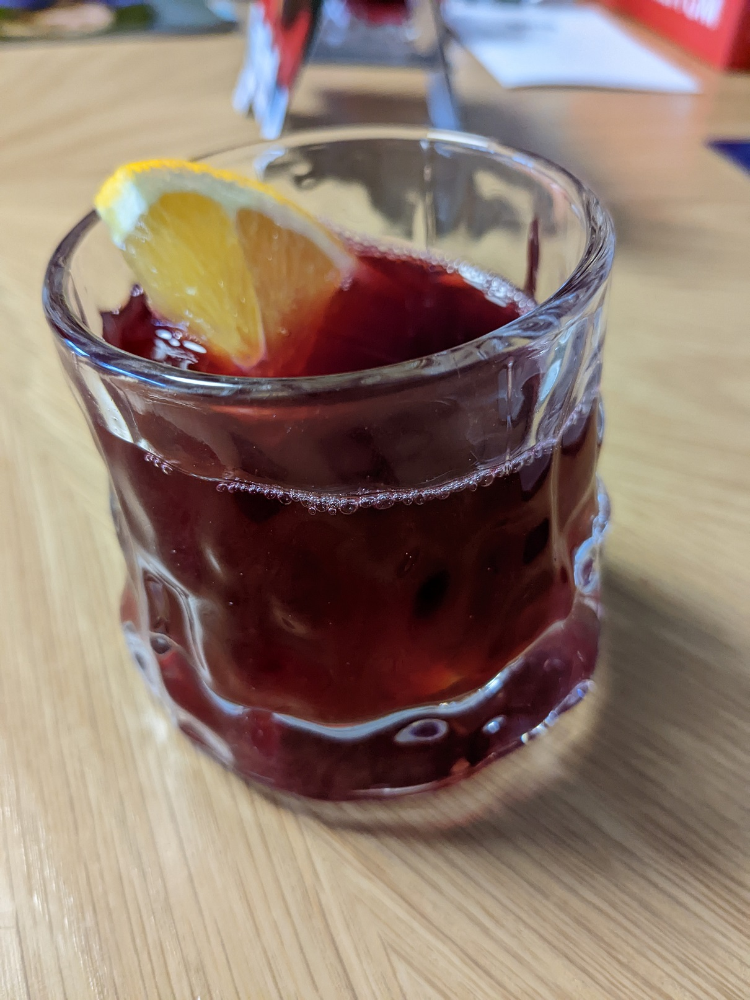

# Zaubertrank (Jamaican Sorrel Drink)

## Zutaten

| Menge             | Zutat           |
|-------------------|-----------------|
| 50 g              | Hibiskus Blüten |
| 1 Stk. (ca. 50 g) | Bio Ingwer      |
| 100 g             | Zucker          |
| 2 Stk             | Zimtstangen     |
| 1 Stk             | Bio Orangen     |
| 3 L               | Wasser          |

## Zubereitung

* Orange in Scheiben schneiden
* Ingwer schälen und in Scheiben schneiden
* Alles in einen Topf und 3L Wasser rein
* Aufkochen bei grosser Hitze
* Auf kleine Hitze drehen und 30 min Kochen lassen
* Zucker beimischen und rühren
* Abstellen und mind. 2 Std. abkühlen lassen (oder über Nacht für intensiveren Geschmack)
* Absieben in Flaschen oder andere Behälter

## Servieren
Mit Eis und einer kleinen Scheibe Orange. Es kann auch etwas Rum beigemischt werden.

*Zaubertrank*
