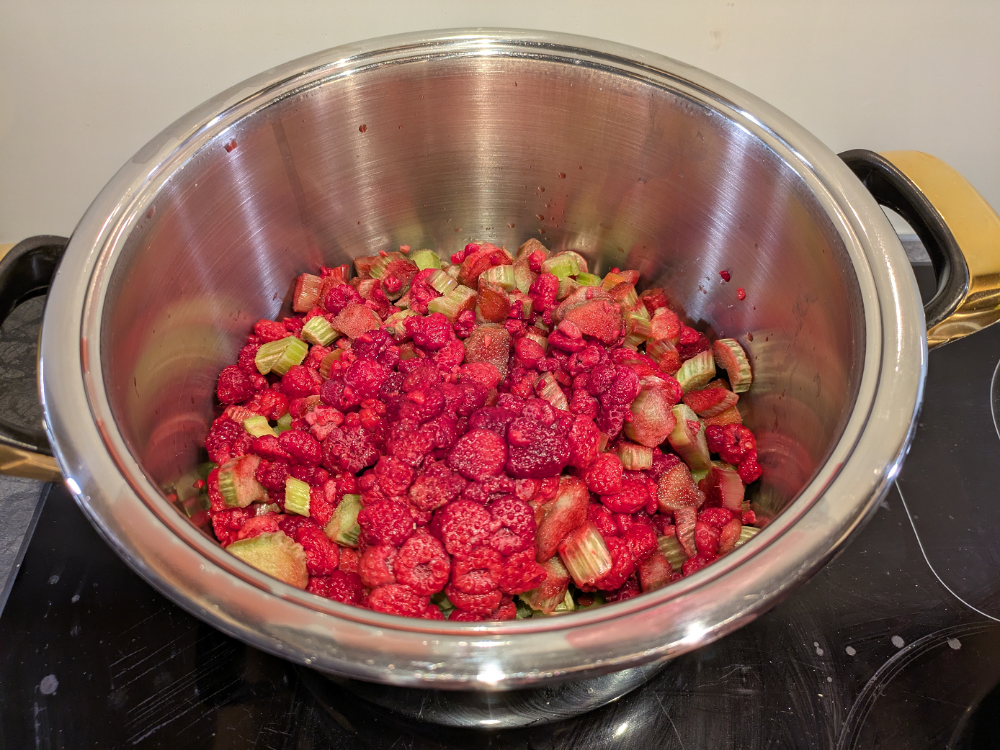
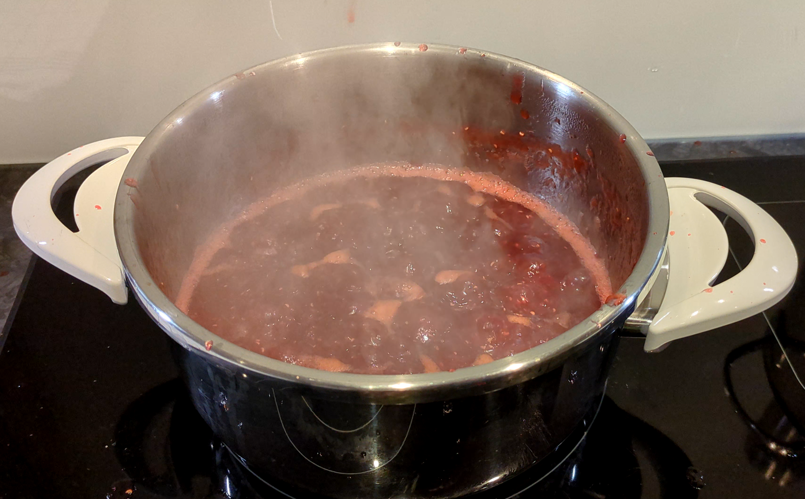
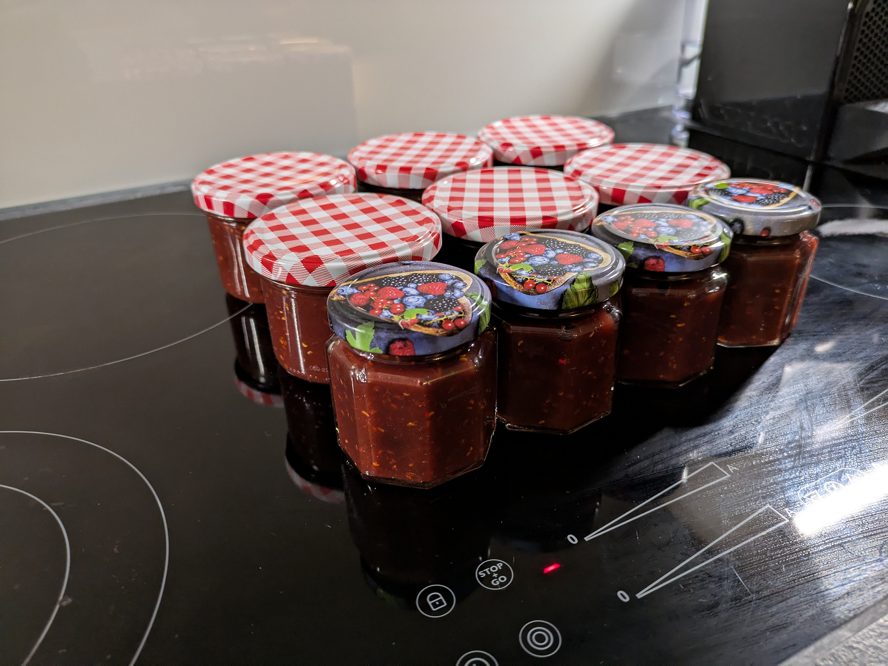

# Rhabarber-Himbeer Konfitüre

## Zutaten

| Menge     | Zutat                                |
|-----------|--------------------------------------|
| 1200 g    | Rhabarber (tiefgekühlt oder frische) |
| 1000 g    | Himbeeren (tiefgekühlt oder frische) |
| 1000 g    | Zucker                               |
| 2         | Zitronen                             |

Himbeeren und Rhabarber waschen, absieben, in einen grossen Topf geben und pürieren. Zitronen pressen und zusammen mit dem Zucker beigeben, unter Rühren aufkochen, unter ständigem Rühren ca. 25 Min. sprudeln kochen. Bei Bedarf Schaum mit einem Schaumlöffel abschäumen. [Gelierprobe](#Gelierprobe) machen. Konfitüre siedend heiss bis knapp unter den Rand in die sauberen, vorgewärmten Gläser füllen, sofort verschliessen. Gläser mit Schraubdeckel kurz auf den Kopf stellen, auf metallischer Unterlage wie z.B. einem Backblech auskühlen.

Insgesamt ergibt das ca. 2'100g Konfitüre

### Gelierprobe
Wenig heisse Konfitüre auf einen Teller geben, etwas abkühlen. Fliesst sie nicht mehr und bildet sich nach kurzer Zeit eine feine Haut, ist die richtige Konsistenz erreicht. Andernfalls Konfitüre kurz weiterkochen, erneut testen.

