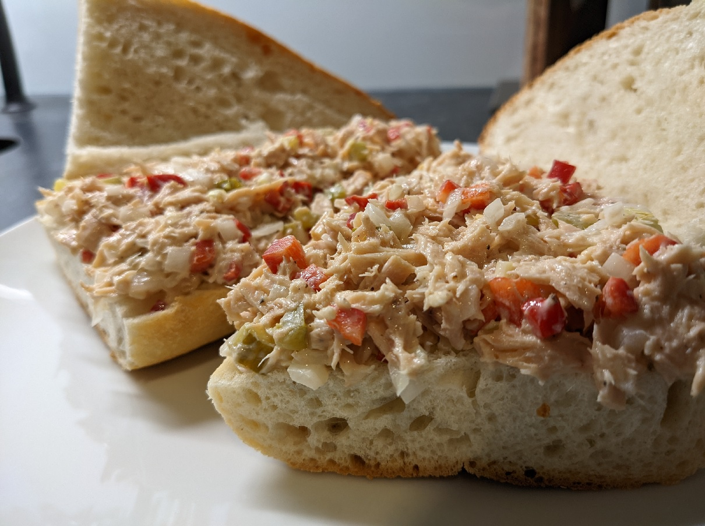
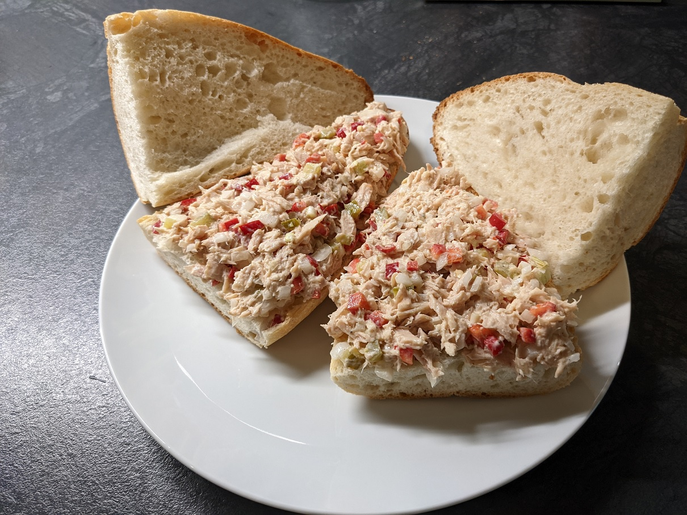

# Thunfisch Sandwich

| Menge		| Zutat												|
|-----------|---------------------------------------------------|
| 1			| Dose Thunfisch (155 gr netto) in Öl				|
| 2			| Sandwich Brötchen									|
| 4 EL		| Mayonnaise										|
| 2 EL		| Kleingehackte rote Zwiebeln                  	    |
| 2 EL		| Kleingehackte grüne Peperoni						|
| 2 EL		| Kleingehackte rote Capia-Pfeffer					|
| 2 EL		| Kleingehackte Essiggurken							|
| 2 EL		| Kleingehackte grüne Peperoni						|
| 1 Prise	| Salz												|
| 1 Prise	| Pfeffer											|
| 2 TL		| Zitronenkonzentrat								|

### Zubereitung
In einer grossen Schale den Thunfisch, Mayonnaise, grüne Peperoni, rote Capia-Pfeffer, Zwiebeln, Gurken und Zitronenkonzentrat mischen. Prise Salz und Pfeffer dazugeben. Zwischen die Sandwich Brote aufstreichen und servieren.

*Thunfisch Sandwich*

*Thunfisch Sandwich*